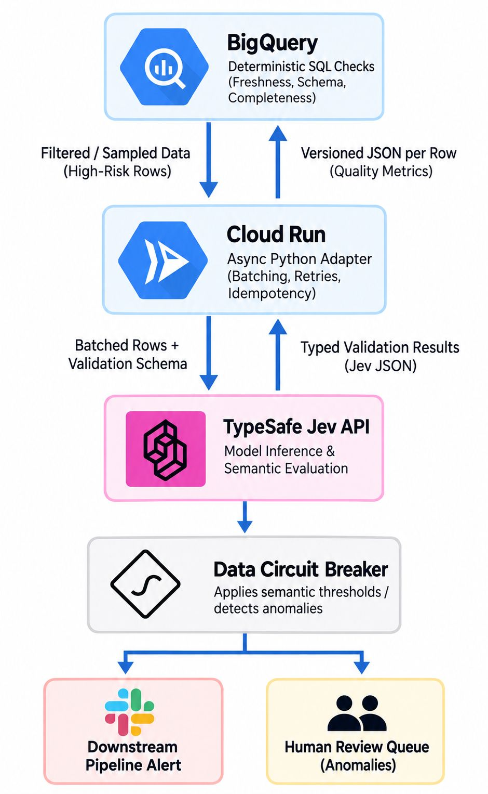

# semantic-drift-sentinel

**Semantic data quality as a continuous infrastructure metric.**

BigQuery already tells you whether data is fresh, complete, unique, and
structurally valid. The harder problem: a pipeline passes *every* deterministic
check, but the underlying data has silently drifted in **meaning**.

This repo is a runnable reference implementation of a layered, top-to-bottom
pattern that catches those silent meaning changes without blowing up your cloud
compute budget. It treats a semantic quality score as a first-class ops metric
you monitor in production, with a circuit breaker at the gate.

**📊 Visual explainer:** [**tanishque99.github.io/semantic-drift-sentinel**](https://tanishque99.github.io/semantic-drift-sentinel/), an interactive walkthrough of the whole pattern (also in [`index.html`](index.html), open it locally with no server).

```bash
git clone https://github.com/Tanishque99/semantic-drift-sentinel
cd semantic-drift-sentinel
make install
export TYPESAFE_API_KEY=ts-...   # or put it in a local .env file
make demo         # runs the full loop on sample data against Jev
```

---

## The architecture



Five layers, each a file you can open live:

| # | Layer | In production | In this repo |
|---|-------|---------------|--------------|
| 1 | **Ingestion & filtering** | BigQuery deterministic SQL checks; route high-risk/sampled rows out | [`warehouse.py`](src/sentinel/warehouse.py) (DuckDB) + [`bigquery/01_deterministic_checks.sql`](bigquery/01_deterministic_checks.sql) |
| 2 | **Async compute** | Cloud Run Python adapter: batching, retries, idempotency, concurrency throttling | [`adapter.py`](src/sentinel/adapter.py) |
| 3 | **Semantic evaluation** | TypeSafe **Jev** API: model inference + strict typed JSON scoring | [`evaluator/`](src/sentinel/evaluator/) + [`schemas.py`](src/sentinel/schemas.py) |
| 4 | **Data circuit breaker** | Apply semantic thresholds; trip → alert / human review | [`circuit_breaker.py`](src/sentinel/circuit_breaker.py) |
| 5 | **Closed loop** | Write versioned quality metrics back to BigQuery to trace drift over time | [`warehouse.py`](src/sentinel/warehouse.py) + [`bigquery/02_quality_metrics_schema.sql`](bigquery/02_quality_metrics_schema.sql) |

The real thesis: **at scale the LLM/Jev call is the easy part.** The hard part
is the engineering boundary around it, concurrency throttling, error handling,
and absolute cost control. Once that boundary is set, operational metrics become
far more useful than a raw model score.

---

## The demo in one picture

The sample dataset is two deployment versions of the same support-ticket
pipeline. Between `v1` and `v2`, an upstream prompt change silently regressed:
`v2` resolution summaries no longer address the actual ticket. **Both versions
pass every deterministic check.**

```
1 · BigQuery · deterministic SQL checks
  v1  completeness PASS  schema PASS  uniqueness PASS  freshness PASS
  v2  completeness PASS  schema PASS  uniqueness PASS  freshness PASS   ← all green

4 · data circuit breaker
  🚨 CIRCUIT BREAKER TRIPPED (OPEN)
     deployment     v2
     mean quality   0.532
     drift vs base  +0.401
     reason         semantic drift 0.40 > 0.15; mean quality 0.53 < floor 0.70
     actions        fired pipeline alert · routed 3 worst rows to human review

operational metrics
  mean semantic quality · v1        0.933
  mean semantic quality · v2        0.532
  semantic drift (v1→v2)           +0.401
  human vs evaluator disagreement   31%
  latency p50 / p95                 …
  total cost per loop               $…
```

The core question, answered automatically on every deployment:
**did this deployment preserve the meaning of our data, and can we prove it at scale?**

---

## Two drift scenarios

The pipeline is generic over its data (see [`datasets.py`](src/sentinel/datasets.py)).
Two sample datasets ship with the repo; pick one with the `DATASET` env var.

| Dataset | Where the meaning drifts | Deterministic checks |
|---------|--------------------------|----------------------|
| `tickets` (default) | a free-text column: v2 resolution summaries stop addressing the ticket | all pass |
| `goods` | an enum column: v2 silently miscategorises products into a different valid category | all pass |

The consumer goods case is the subtle one: the drifted category is still a
**valid enum value**, the product name and description are untouched, so schema,
completeness, uniqueness, and freshness are all green. Only the *meaning* of the
category is wrong, and only the semantic evaluator catches it.

```bash
make demo-tickets      # support-ticket summary drift (default)
make demo-goods        # consumer goods data drift
```

---

## The typed evaluator (the "TypeSafe" boundary)

The semantic layer is powered by [**Jev**](https://typesafe.ai), the TypeSafe AI
"System One" model. Its answers validate against a pydantic schema, so the
pipeline never parses free text. The contract mirrors Jev's own
`state + questions → typed answers` shape (Noul / Choice / Score):

| Backend | Needs |
|---------|-------|
| `jev` | the real [TypeSafe AI](https://typesafe.ai) product; `pip install typesafe-sdk` + `TYPESAFE_API_KEY` |

```bash
make demo              # runs the loop against Jev
make jev               # same, with JEV_BACKEND=jev set explicitly
```

The typed boundary (`schemas.py`) is deliberately backend-agnostic, so the
evaluator can be swapped out without the rest of the pipeline moving.

---

## Operational metrics

The numbers worth monitoring (all computed in [`metrics.py`](src/sentinel/metrics.py)):

- **Semantic drift by deployment version**: the headline signal
- **Human vs evaluator disagreement rate**: is the judge trustworthy?
- **False-positive rate vs latency overhead**: the cost of catching drift
- **Total cost per evaluation loop**: proven, not assumed

---

## Run it other ways

```bash
make test              # pytest: deterministic checks pass, yet drift is caught
make serve             # run the Cloud Run async adapter locally (FastAPI on :8080)
```

```bash
# the adapter as a service
curl -s localhost:8080/evaluate -H 'content-type: application/json' \
  -d '{"rows":[{"row_id":"T1","deployment_version":"v2",
       "ticket_text":"I was charged twice","category":"billing",
       "resolution_summary":"You can view invoices in settings."}]}' | jq
```

Deploying the real topology (Cloud Run + BigQuery) is documented in
[`deploy/README.md`](deploy/README.md). The SQL in `bigquery/` is already written
for BigQuery and maps 1:1 onto the local DuckDB implementation.

---

## Repo layout

```
src/sentinel/
  schemas.py         typed contracts (Noul/Choice/Score), the TypeSafe boundary
  config.py          env-driven settings (reads TYPESAFE_API_KEY)
  sampledata.py      deterministic v1/v2 dataset with planted semantic drift
  warehouse.py       layer 1 + 5: deterministic checks, routing, closed loop
  adapter.py         layer 2: async batching, retries, idempotency, throttling
  evaluator/         layer 3: the Jev evaluator behind one interface
  circuit_breaker.py layer 4: semantic thresholds, trip, route to review
  metrics.py         operational metrics
  demo.py            the end-to-end live demo
bigquery/            the same checks + metrics schema, written for BigQuery
deploy/              Dockerfile + Cloud Run / BigQuery deploy notes
tests/               smoke tests (semantic tests need TYPESAFE_API_KEY)
```

---

## Credits

- **Jev** by [TypeSafe AI](https://typesafe.ai), the "System One" typed
  evaluation model this pattern is built around ([docs](https://docs.typesafe.ai)).
- Built for [AI Tinkerers Phoenix](https://phoenix.aitinkerers.org/).

MIT licensed.
